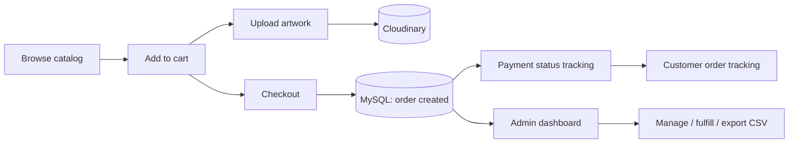

# PrintSmart 🖨️

A full-stack online printing storefront. Customers browse print products, upload their own
artwork, place and track orders; admins run the entire business — products, orders, staff,
customers, and analytics — from a single dashboard.

**🔗 Live site:** <https://your-live-url.com> &nbsp;•&nbsp; **Stack:** Python · Flask · MySQL · Cloudinary

<!-- Add a screenshot or GIF here — it's the single biggest upgrade to this README.
     Capture the storefront home + the admin dashboard. Drop the file in /docs and link it: -->
<!--  -->

---

## ✨ Features

**Storefront**
- Product catalog with categories, variants, features, and customer reviews
- Cart and checkout with order + payment-status tracking
- Customer artwork upload (stored on Cloudinary)
- Order history and live order tracking for each customer

**Accounts & security**
- Email/password auth with hashed passwords (Werkzeug)
- Social login via **Google** and **Facebook** (OAuth 2.0, Authlib)
- Email **OTP verification** and signed, time-limited password-reset links
- Role-based access: `customer`, `admin`, `super_admin`

**Admin dashboard**
- Manage products, variants, orders, staff, and customers
- Sales/operations analytics
- CSV exports, audit logging, and soft deletes
- In-app support chat between customers and staff

---

## 🛠️ Tech stack

| Layer | Tools |
|---|---|
| **Backend** | Python, Flask, Jinja2 |
| **Database** | MySQL (`mysql-connector-python`) |
| **Auth** | Werkzeug password hashing, Authlib (Google/Facebook OAuth), `itsdangerous` signed tokens |
| **Media** | Cloudinary |
| **Frontend** | HTML, CSS, JavaScript (server-rendered Jinja templates) |
| **Deployment** | Gunicorn, environment-based config, `ProxyFix` for reverse-proxy hosting |

**Security notes:** all SQL uses parameterized queries (injection-safe), passwords are
hashed (never stored in plaintext), uploads pass through `secure_filename`, and reset/OTP
flows use signed, expiring tokens.

---

## 🏗️ Order flow



---

## 🚀 Running locally

```bash
# 1. Clone
git clone https://github.com/rayysalcedo/PrintSmart.git
cd PrintSmart

# 2. Create a virtual environment
python -m venv venv
source venv/bin/activate        # Windows: venv\Scripts\activate

# 3. Install dependencies
pip install -r requirements.txt

# 4. Configure environment
cp .env.example .env            # then fill in your values (see below)

# 5. Create the database
#    Import the schema into MySQL:
mysql -u <user> -p <database_name> < printsmart_db.sql

# 6. Run
flask run                       # dev
# or, production-style:
gunicorn app:app
```

### Environment variables (`.env`)

Fill these in `.env` (see `config.py` / `.env.example` for exact names):

- **App:** `SECRET_KEY`
- **Database:** MySQL host, user, password, database name
- **Cloudinary:** cloud name, API key, API secret
- **Google OAuth:** client ID, client secret
- **Facebook OAuth:** client ID, client secret
- **Email (OTP / resets):** SMTP host, user, password

> ⚠️ Never commit `.env` — it's already in `.gitignore`.

---

## 📂 Project structure

```
PrintSmart/
├── app.py              # Flask app: routes, auth, orders, admin
├── config.py           # Environment-based configuration
├── requirements.txt
├── printsmart_db.sql   # MySQL schema
├── templates/          # Jinja2 templates (storefront + admin)
└── static/             # CSS, JS, images
```

---

## 🗺️ Roadmap

- [ ] Split `app.py` into Flask blueprints (auth / shop / admin)
- [ ] Add automated tests (auth, cart, checkout)
- [ ] Move ad-hoc schema changes into Flask-Migrate migrations

---

Built by **Ray Salcedo** — [portfolio]([https://rayysalcedo.github.io/portfolio/](https://raysalcedo.netlify.app)
